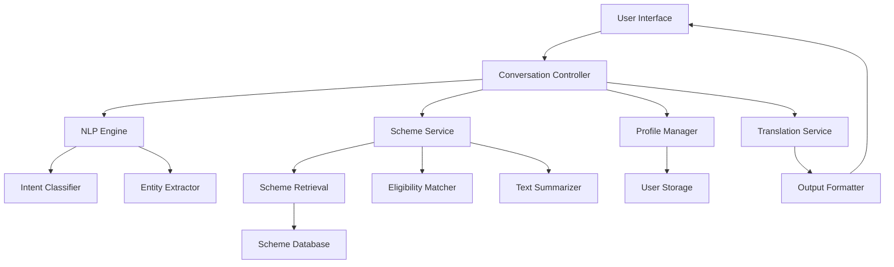

# Design Document: Civic Information Assistant

## Overview

The Civic Information Assistant is a text-based conversational system that helps citizens understand and access government schemes. The architecture follows a modular design with clear separation between natural language processing, business logic, data management, and presentation layers.

The system operates as a stateful application that maintains user profiles and conversation context. It uses NLP for intent detection, rule-based matching for eligibility assessment, and text summarization for simplifying official documents. The design prioritizes low-bandwidth operation, multilingual support, and data privacy.

## Architecture

### High-Level Architecture



### Component Layers

1. **Presentation Layer**: User interface and output formatting
2. **Application Layer**: Conversation controller and workflow orchestration
3. **Service Layer**: NLP engine, scheme service, profile manager, translation service
4. **Data Layer**: Scheme database and user storage

### Design Principles

- **Modularity**: Each component has a single, well-defined responsibility
- **Stateful Conversations**: Maintain context across user interactions
- **Fail-Safe**: Graceful degradation when components fail
- **Privacy-First**: Minimal data collection, secure storage, user control
- **Bandwidth-Conscious**: Text-only interactions, compressed payloads, lazy loading

## Components and Interfaces

### 1. Conversation Controller

**Responsibility**: Orchestrates the conversation flow, manages state, and coordinates between components.

**Interface**:
```
class ConversationController:
    function handleUserInput(userId: String, message: String) -> Response
    function initializeSession(userId: String) -> Session
    function getSessionState(userId: String) -> SessionState
    function updateSessionState(userId: String, state: SessionState) -> void
```

**Behavior**:
- Routes user messages to appropriate services based on conversation state
- Manages multi-turn conversations for profile collection
- Coordinates between NLP, profile, and scheme services
- Handles error recovery and fallback responses

### 2. NLP Engine

**Responsibility**: Analyzes user queries to extract intent and entities.

**Interface**:
```
class NLPEngine:
    function detectIntent(query: String) -> Intent
    function extractEntities(query: String) -> List<Entity>
    function getConfidenceScore(query: String, intent: Intent) -> Float
```

**Intent Types**:
- `SCHEME_INFO`: User wants information about a scheme
- `ELIGIBILITY_CHECK`: User wants to check eligibility
- `APPLICATION_GUIDANCE`: User wants application instructions
- `PROFILE_UPDATE`: User wants to update their details
- `GENERAL_QUERY`: General question about services
- `UNCLEAR`: Intent cannot be determined

**Entity Types**:
- `SCHEME_NAME`: Name of a government scheme
- `AGE`: User's age
- `INCOME`: User's income level
- `OCCUPATION`: User's occupation
- `DOCUMENT_TYPE`: Type of document mentioned

**Implementation Approach**:
- Use keyword matching and pattern recognition for intent classification
- Maintain a dictionary of scheme names and aliases
- Use regular expressions for entity extraction (numbers, currency, etc.)
- Calculate confidence based on keyword matches and query structure

### 3. Profile Manager

**Responsibility**: Manages user profile data including collection, validation, storage, and retrieval.

**Interface**:
```
class ProfileManager:
    function createProfile(userId: String) -> UserProfile
    function getProfile(userId: String) -> UserProfile
    function updateProfile(userId: String, field: String, value: Any) -> Result
    function validateField(field: String, value: Any) -> ValidationResult
    function deleteProfile(userId: String) -> void
    function isProfileComplete(userId: String) -> Boolean
```

**Data Model**:
```
class UserProfile:
    userId: String
    age: Integer (optional)
    income: Float (optional)
    occupation: String (optional)
    languagePreference: String (default: "en")
    createdAt: Timestamp
    updatedAt: Timestamp
```

**Validation Rules**:
- Age: Must be positive integer between 1 and 150
- Income: Must be non-negative number
- Occupation: Must be non-empty string
- Language: Must be supported language code

### 4. Scheme Service

**Responsibility**: Retrieves scheme information, assesses eligibility, and provides application guidance.

**Interface**:
```
class SchemeService:
    function getSchemeInfo(schemeName: String) -> SchemeInfo
    function checkEligibility(schemeName: String, profile: UserProfile) -> EligibilityResult
    function getApplicationSteps(schemeName: String) -> List<Step>
    function getRequiredDocuments(schemeName: String) -> List<Document>
    function searchSchemes(query: String) -> List<SchemeInfo>
    function getEligibleSchemes(profile: UserProfile) -> List<SchemeInfo>
```

**Data Model**:
```
class SchemeInfo:
    schemeId: String
    name: String
    description: String
    officialText: String
    simplifiedText: String
    eligibilityCriteria: EligibilityCriteria
    requiredDocuments: List<Document>
    applicationSteps: List<Step>
    applicationMethods: List<String> (e.g., ["online", "offline"])
    category: String
    lastUpdated: Timestamp

class EligibilityCriteria:
    minAge: Integer (optional)
    maxAge: Integer (optional)
    minIncome: Float (optional)
    maxIncome: Float (optional)
    occupations: List<String> (optional)
    additionalConditions: List<Condition>

class EligibilityResult:
    isEligible: Boolean
    matchedCriteria: List<String>
    unmatchedCriteria: List<String>
    missingInformation: List<String>
    explanation: String

class Document:
    name: String
    description: String
    isRequired: Boolean

class Step:
    stepNumber: Integer
    description: String
    estimatedTime: String (optional)
```

### 5. Eligibility Matcher

**Responsibility**: Implements rule-based logic to determine if a user profile satisfies scheme eligibility criteria.

**Interface**:
```
class EligibilityMatcher:
    function match(profile: UserProfile, criteria: EligibilityCriteria) -> EligibilityResult
    function evaluateCondition(profile: UserProfile, condition: Condition) -> Boolean
    function explainMismatch(profile: UserProfile, criteria: EligibilityCriteria) -> String
```

**Matching Logic**:
1. Check age bounds: `criteria.minAge <= profile.age <= criteria.maxAge`
2. Check income bounds: `criteria.minIncome <= profile.income <= criteria.maxIncome`
3. Check occupation: `profile.occupation in criteria.occupations` (if specified)
4. Evaluate additional conditions using rule engine
5. Return result with matched/unmatched criteria

**Rule Engine**:
- Supports AND, OR, NOT logical operators
- Supports comparison operators: ==, !=, <, >, <=, >=
- Supports field references: profile.age, profile.income, profile.occupation
- Example rule: `(profile.age >= 18 AND profile.age <= 35) OR profile.occupation == "student"`

### 6. Text Summarizer

**Responsibility**: Simplifies official government documents into plain language.

**Interface**:
```
class TextSummarizer:
    function simplify(officialText: String) -> String
    function extractKeyPoints(text: String) -> List<String>
    function simplifyVocabulary(text: String) -> String
```

**Simplification Strategy**:
1. **Sentence Simplification**: Break long sentences into shorter ones
2. **Vocabulary Replacement**: Replace complex terms with simpler alternatives
3. **Structure Clarification**: Use bullet points and numbered lists
4. **Jargon Removal**: Replace legal/bureaucratic terms with plain language
5. **Active Voice**: Convert passive constructions to active voice

**Implementation Approach**:
- Maintain a dictionary of complex-to-simple term mappings
- Use sentence length heuristics to identify complex sentences
- Apply template-based transformations for common patterns
- Preserve critical information (dates, amounts, requirements)

### 7. Translation Service

**Responsibility**: Translates text output to user's preferred language.

**Interface**:
```
class TranslationService:
    function translate(text: String, targetLanguage: String) -> String
    function isLanguageSupported(languageCode: String) -> Boolean
    function getSupportedLanguages() -> List<Language>
    function translateBatch(texts: List<String>, targetLanguage: String) -> List<String>
```

**Supported Languages** (initial set):
- English (en)
- Hindi (hi)
- Spanish (es)
- French (fr)
- Arabic (ar)

**Implementation Approach**:
- Use external translation API for text translation
- Cache common translations to reduce API calls
- Fallback to English if translation fails
- Translate only user-facing text, not internal data

### 8. Scheme Database

**Responsibility**: Stores and retrieves scheme information.

**Interface**:
```
class SchemeDatabase:
    function getSchemeById(schemeId: String) -> SchemeInfo
    function getSchemeByName(name: String) -> SchemeInfo
    function searchSchemes(keywords: List<String>) -> List<SchemeInfo>
    function getAllSchemes() -> List<SchemeInfo>
    function filterByCategory(category: String) -> List<SchemeInfo>
```

**Data Source**:
- Publicly available government scheme data
- Structured JSON or database format
- Regular updates from official sources
- Versioning to track changes

### 9. User Storage

**Responsibility**: Securely stores user profile data.

**Interface**:
```
class UserStorage:
    function save(profile: UserProfile) -> void
    function load(userId: String) -> UserProfile
    function delete(userId: String) -> void
    function exists(userId: String) -> Boolean
```

**Security Measures**:
- Encrypt sensitive data at rest
- Use secure identifiers (UUIDs) for user IDs
- Implement access controls
- Support data deletion for privacy compliance
- No sharing with third parties

### 10. Output Formatter

**Responsibility**: Formats responses for optimal display in low-bandwidth conditions.

**Interface**:
```
class OutputFormatter:
    function formatSchemeInfo(scheme: SchemeInfo) -> String
    function formatEligibilityResult(result: EligibilityResult) -> String
    function formatApplicationSteps(steps: List<Step>) -> String
    function formatDocumentList(docs: List<Document>) -> String
    function addDisclaimer(text: String) -> String
```

**Formatting Principles**:
- Use plain text with minimal formatting
- Structure with clear headings and sections
- Use numbered lists for steps
- Use bullet points for items
- Keep line length reasonable for mobile displays
- Include disclaimer footer on relevant responses

## Data Models

### Session State

```
class SessionState:
    userId: String
    currentIntent: Intent
    conversationHistory: List<Message>
    pendingProfileFields: List<String>
    lastActivity: Timestamp
    
class Message:
    role: String (user/assistant)
    content: String
    timestamp: Timestamp
```

### Response

```
class Response:
    text: String
    requiresInput: Boolean
    suggestedActions: List<String>
    metadata: Map<String, Any>
```

## Correctness Properties

*A property is a characteristic or behavior that should hold true across all valid executions of a system—essentially, a formal statement about what the system should do. Properties serve as the bridge between human-readable specifications and machine-verifiable correctness guarantees.*


### Property Reflection

After analyzing all acceptance criteria, I identified several areas where properties can be consolidated:

**Intent Classification (1.2, 1.3, 1.4)**: These three properties all test keyword-based intent classification for different intent types. They can be combined into a single comprehensive property that tests intent classification across all intent types.

**First Interaction Profile Requests (2.1, 2.2, 2.3)**: These are all testing the same behavior (requesting profile fields on first interaction) for different fields. These should be combined into a single example test that verifies all required fields are requested.

**Eligibility Determination (4.2, 4.3)**: These test positive and negative eligibility cases. They can be combined into a single property that tests correct eligibility determination for both cases.

**Application Steps Presentation (5.2, 5.3)**: Both test that steps are numbered and sequential. These can be combined into a single property about step ordering.

**Disclaimer Content (8.3, 8.4, 8.5)**: These all test specific content in the disclaimer. They can be combined into a single example test that verifies all required disclaimer elements.

**Profile Storage (2.6, 2.7)**: Both test profile persistence. The update test (2.7) subsumes the initial storage test (2.6), so we only need the more comprehensive update property.

After reflection, we have approximately 28 unique properties and 5 example tests.

### Correctness Properties

#### Property 1: Intent Detection Returns Valid Intent
*For any* user query, the NLP engine should return one of the defined intent types (SCHEME_INFO, ELIGIBILITY_CHECK, APPLICATION_GUIDANCE, PROFILE_UPDATE, GENERAL_QUERY, or UNCLEAR).

**Validates: Requirements 1.1**

#### Property 2: Keyword-Based Intent Classification
*For any* query containing keywords associated with a specific intent type, the NLP engine should classify it with the corresponding intent (scheme keywords → SCHEME_INFO, eligibility keywords → ELIGIBILITY_CHECK, application keywords → APPLICATION_GUIDANCE).

**Validates: Requirements 1.2, 1.3, 1.4**

#### Property 3: Low Confidence Triggers Clarification
*For any* query where the NLP engine's confidence score is below the threshold, the system should request clarification from the user.

**Validates: Requirements 1.5**

#### Property 4: Age Validation Accepts Valid Range
*For any* integer value between 1 and 150, the profile manager should accept it as a valid age; for any value outside this range or non-integer, it should reject it.

**Validates: Requirements 2.4**

#### Property 5: Income Validation Accepts Non-Negative
*For any* non-negative number, the profile manager should accept it as valid income; for any negative number, it should reject it.

**Validates: Requirements 2.5**

#### Property 6: Profile Update Round Trip
*For any* user profile and any valid field update, updating the profile then retrieving it should return the updated value.

**Validates: Requirements 2.6, 2.7**

#### Property 7: Scheme Request Returns Document
*For any* valid scheme name, requesting scheme information should return an official document for that scheme.

**Validates: Requirements 3.1**

#### Property 8: Document Summarization Always Produces Output
*For any* official document, the text summarizer should generate simplified text (non-empty output).

**Validates: Requirements 3.2**

#### Property 9: Scheme Response Contains Simplified Text
*For any* scheme information response, the output should contain the simplified text version of the official document.

**Validates: Requirements 3.3**

#### Property 10: Eligibility Matching Performs Comparison
*For any* user profile and eligibility criteria, the eligibility matcher should compare all criteria fields (age, income, occupation) against the profile.

**Validates: Requirements 4.1**

#### Property 11: Eligibility Determination Correctness
*For any* user profile and eligibility criteria, if the profile satisfies all criteria, the result should indicate eligible; if any criterion is not satisfied, the result should indicate not eligible.

**Validates: Requirements 4.2, 4.3**

#### Property 12: Ineligibility Explanation Completeness
*For any* ineligible result, the explanation should list all criteria that were not met by the user profile.

**Validates: Requirements 4.4**

#### Property 13: Missing Information Triggers Request
*For any* eligibility check where required profile fields are missing, the system should request the missing information before completing the assessment.

**Validates: Requirements 4.5**

#### Property 14: Application Request Returns Documents
*For any* scheme with application information, requesting application guidance should return a non-empty list of required documents.

**Validates: Requirements 5.1**

#### Property 15: Application Steps Sequential Ordering
*For any* scheme's application steps, each step should have a sequential number starting from 1 with no gaps.

**Validates: Requirements 5.2, 5.3**

#### Property 16: Multiple Application Methods Displayed
*For any* scheme with both online and offline application methods, the response should include both methods.

**Validates: Requirements 5.4**

#### Property 17: Language Preference Round Trip
*For any* supported language code, setting a user's language preference then retrieving it should return the same language code.

**Validates: Requirements 6.1**

#### Property 18: Output Translation to Preferred Language
*For any* user with a language preference set, generated output text should be in that language (or English with notification if translation unavailable).

**Validates: Requirements 6.2**

#### Property 19: Unsupported Language Fallback
*For any* unsupported language code, the system should provide English text and inform the user that the requested language is not available.

**Validates: Requirements 6.3**

#### Property 20: Response Payload Size Limit
*For any* system response, the payload size should be below the defined bandwidth threshold (e.g., 50KB for text content).

**Validates: Requirements 7.1**

#### Property 21: Media Elements Optional Loading
*For any* response containing media elements (images, videos), each media element should have an optional loading flag set to true.

**Validates: Requirements 7.5**

#### Property 22: Scheme Response Includes Disclaimer
*For any* scheme information response, the output should contain a reference to or the full text of the disclaimer.

**Validates: Requirements 8.2**

#### Property 23: Privacy Notice During Collection
*For any* profile data collection interaction, the system should provide information about how the data will be used.

**Validates: Requirements 9.1**

#### Property 24: Profile Deletion Completeness
*For any* user profile, after requesting deletion, attempting to retrieve the profile should indicate it does not exist.

**Validates: Requirements 9.4**

#### Property 25: NLP Failure Error Handling
*For any* NLP engine failure, the system should display an error message and suggest the user rephrase their query.

**Validates: Requirements 10.1**

#### Property 26: Scheme Data Unavailable Handling
*For any* scheme data retrieval failure, the system should inform the user and suggest trying again later.

**Validates: Requirements 10.2**

#### Property 27: Summarizer Failure Fallback
*For any* text summarizer failure, the system should provide the original official document with a warning message.

**Validates: Requirements 10.3**

#### Property 28: Unexpected Error Handling
*For any* unexpected error, the system should log the error details and display a user-friendly message to the user.

**Validates: Requirements 10.5**

## Error Handling

### Error Categories

1. **Input Validation Errors**: Invalid user input (age, income, occupation)
2. **NLP Processing Errors**: Query parsing failures, low confidence
3. **Data Retrieval Errors**: Scheme not found, database unavailable
4. **Service Failures**: Summarizer failure, translation failure
5. **Network Errors**: Connectivity loss, timeout
6. **System Errors**: Unexpected exceptions, resource exhaustion

### Error Handling Strategy

**Graceful Degradation**:
- When summarizer fails, provide original document
- When translation fails, provide English text
- When NLP confidence is low, ask for clarification
- When data is unavailable, suggest retry

**User Communication**:
- All errors result in user-friendly messages
- Technical details logged but not shown to users
- Actionable suggestions provided (rephrase, retry, contact support)
- Error messages translated to user's language when possible

**State Preservation**:
- Cache conversation state during network errors
- Preserve partial profile data during collection
- Allow resumption after transient failures

**Logging and Monitoring**:
- Log all errors with context (user ID, query, timestamp)
- Track error rates by category
- Alert on critical failures (database down, service unavailable)

### Error Response Format

```
class ErrorResponse:
    errorCode: String
    userMessage: String
    suggestedAction: String
    canRetry: Boolean
    timestamp: Timestamp
```

## Testing Strategy

### Dual Testing Approach

The system will be validated using both unit tests and property-based tests, which are complementary and necessary for comprehensive coverage:

- **Unit tests**: Verify specific examples, edge cases, and error conditions
- **Property tests**: Verify universal properties across all inputs

Together, these approaches provide comprehensive coverage where unit tests catch concrete bugs and property tests verify general correctness.

### Property-Based Testing

**Framework Selection**:
- The implementation will use a property-based testing library appropriate for the chosen language
- Minimum 100 iterations per property test (due to randomization)
- Each test will be tagged with a comment referencing the design property

**Tag Format**:
```
# Feature: civic-information-assistant, Property N: [property text]
```

**Property Test Coverage**:
- Each of the 28 correctness properties will be implemented as a single property-based test
- Tests will generate random inputs (queries, profiles, schemes) to verify properties hold universally
- Generators will be created for: user queries, user profiles, scheme data, eligibility criteria

**Example Property Test Structure**:
```
test_property_age_validation():
    # Feature: civic-information-assistant, Property 4: Age Validation Accepts Valid Range
    for age in generate_random_integers():
        result = profile_manager.validateField("age", age)
        if 1 <= age <= 150:
            assert result.isValid == True
        else:
            assert result.isValid == False
```

### Unit Testing

**Focus Areas**:
- Specific examples demonstrating correct behavior
- Edge cases (empty strings, boundary values, special characters)
- Error conditions (null inputs, missing data, service failures)
- Integration points between components

**Example Unit Tests**:
- First interaction requests all profile fields (Requirements 2.1, 2.2, 2.3)
- Disclaimer displays on first access (Requirement 8.1)
- Disclaimer contains required text (Requirements 8.3, 8.4, 8.5)
- Empty query handling
- Scheme not found handling
- Profile with missing fields

### Integration Testing

**Test Scenarios**:
1. Complete conversation flow: greeting → profile collection → scheme inquiry → eligibility check → application guidance
2. Profile update flow: create profile → update age → verify eligibility changes
3. Language switching: set language → verify all responses translated
4. Error recovery: trigger error → verify graceful handling → continue conversation

### Test Data

**Scheme Database**:
- Create test schemes with various eligibility criteria
- Include schemes with age bounds, income bounds, occupation requirements
- Include schemes with multiple application methods
- Include schemes with complex eligibility rules

**User Profiles**:
- Generate profiles covering full range of ages (1-150)
- Generate profiles with various income levels (0 to high values)
- Generate profiles with different occupations
- Generate incomplete profiles (missing fields)

**Queries**:
- Generate queries with clear intent keywords
- Generate ambiguous queries
- Generate queries in different languages
- Generate malformed queries

### Performance Testing

**Metrics**:
- Response time for query processing (target: < 2 seconds)
- Response payload size (target: < 50KB)
- Memory usage during conversation
- Database query performance

**Load Testing**:
- Concurrent user sessions
- High query volume
- Large scheme database

### Security Testing

**Areas**:
- Input validation (SQL injection, XSS attempts)
- Data encryption verification
- Access control testing
- Privacy compliance (data deletion, no third-party sharing)

## Implementation Notes

### Technology Considerations

**NLP Engine**:
- Can use lightweight NLP libraries (spaCy, NLTK) or rule-based approaches
- Keyword dictionaries should be easily updatable
- Consider caching intent classifications for common queries

**Text Summarization**:
- Rule-based approach preferred for predictability
- Template-based transformations for common document structures
- Maintain term replacement dictionary

**Translation**:
- Use external API (Google Translate, DeepL) or local models
- Implement caching to reduce API costs
- Batch translations when possible

**Storage**:
- Use lightweight database (SQLite, PostgreSQL)
- Implement encryption for user data
- Consider data retention policies

**Deployment**:
- Containerized deployment for portability
- Support for low-resource environments
- Offline capability for core features

### Scalability Considerations

- Stateless API design for horizontal scaling
- Cache frequently accessed schemes
- Implement rate limiting for API protection
- Use CDN for static content

### Accessibility Considerations

- Text-only interface works with screen readers
- Clear, simple language benefits all users
- Multilingual support increases accessibility
- Low-bandwidth design enables access in rural areas

### Maintenance Considerations

- Regular updates to scheme database
- Monitor error rates and user feedback
- Update term dictionaries for NLP and summarization
- Review and update eligibility rules as policies change
